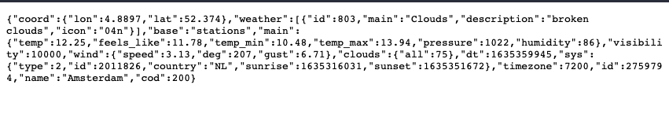

# 💨 WiFan 

This manual is made for an IoT schoolproject. I've created an IoT fan called WiFan. You can controll the fan using an app, a voice assistant, or you can connect it to a weather API to turn on when the temperature rises. In this manual I will show you how I connected my fan to an open weather API using a NodeMCU ESP8266.


The manual will be divided into 4 main sections. ???????????????????
1. Connecting the Relay to the Microcontroller
2. Connecting a power cable to the Relay
3. Setting up the Weather API
4. Putting everything together to make a working product

<br>
<br>

## 📝 Prerequisites
When following this manual I assume that you have the following hardware & software installed. If this is not the case, please set-up your Microcontroller correctly before following this manual.

### ⚙️ Hardware
* NodeMCU ESP8266 Microcontroller (or similar board)
* Relay Module
* Extension Cord (optional but preferable)
* Fan

### 🖥️ Software
* [Arduino IDE](https://www.arduino.cc/en/software)
* NodeMCU USB Drivers

### 📚 Libaries?
* ArduinoJson?
* ArduinoHttpClient?
* ESP8266WiFi
* ESP8266HTTPClient

<br>
<br>

## 🕹️ Step 1: Connecting the Relay
Connect your Microcontroller to your computer via USB. Then take your relay and connect it to your Microcontroller. My relay looked something like this:


As you can see my relay has 4 pins: GND, VCC, NC and SIG. For this case, I'm only using GND, VCC and SIG. The white cable (NC) remains unplugged. I found [this awesome guide](https://diyi0t.com/relay-tutorial-for-arduino-and-esp8266/) on connecting a relay to a Microcontroller. The guide includes the following illustration, showing you how to connect every wire:


Connect the black wire (GND) with the Ground pin on my ESP8266 and connect the red wire (VCC) with the 3V3 pin on your board. Leave the white wire unplugged and connect the yellow wire (SIG) with D7 pin on your board.

> Warning! Connect these wires carefully. The guide I used and the picture above told me to connect the VCC on the relay with the VIN pin on your board when using an ESP8266 or ESP32, because you need a 5V output. I’ve tried it, and my wire immediately started smoking, so please don’t make the same mistake. The 3V3 pin works fine for me instead.

With everything connected, your board should look something like this:


### 🤓 Testing...


After connecting the wires it is time to test our relay. I used the following code:

````c++
int relay = D7;

void setup() {
  pinMode(relay, OUTPUT);
}

void loop() {
  digitalWrite(relay, HIGH);
  delay(2000);
  digitalWrite(relay, LOW);
  delay(2000);
}
````
This simple program start by turning on the relay. 2 seconds after that, it turns off. 2 seconds later, the loop function starts again. This is a simple way to test if everything is working so far.

Did everything work as planned? Congrats! 🥳. Let's move onto the next step.

<br>
<br>

## 🔌 Step 2: Connecting a power cable
A relay is a low-power electrical switch which toggles on and off a high-power (Max 250V) circuit. For this reason we need to connect the relay to the power cable of the object we want to switch. In this case it's a fan. Because I didn't want to ruin my fans power cable, and I might want to switch different higher voltage objects in the future, I decided to use an old extension cord. If you're like me and you don't have experience cutting and stripping wires, I reccomend using an extension cord with a switch. With this extension cord, u can just remove the switch to reveal the wires.


My extension cord looked something like this. As you can see it has a switch, which makes it easy for me to connect the relay. You do need to use a terminal block however with this cord, because both wires will be exposed when you remove the switch and you only need 1 for the relay. After removing the switch or cutting open the cable and revealing/stripping the wires, your extension cord should look something like this:


> As you can see in the picture my extension cord is an ungrounded cable. This might make it a bit easier to connect, but you can't connect every device to this extension cord, because most bigger devices have grounded plugs. I found this out too late which prevented me from connecting the fan I wanted to connect.

Now you can connect your relay to one of the two cables. Just put both stripped ends of 1 wire in your relay and screw it down. Put a terminal block on the other cable to continue the circuit. After you've finished connecting the relay, it should look something like this:


You can see I've connected the blue cable to the relay and the brown cable to the terminal block.

### 🤓 Testing...

Now it's time to test our Frankensteined extension cord switch. I used the same code as step 1 to test the relay. I connected a lamp to the extension cord to see if it really works. The lamp should turn on and off every 2 seconds. I've made a video while testing it so you can see how it should look:


https://user-images.githubusercontent.com/74104639/139117092-a1e6f45d-a5bf-47ae-a006-69da41dad847.mov


If everything worked as planned, we can move onto the next step 🥳

<br>
<br>

## 🌦️ Step 3: Weather API

Now that we can controll our fan using the Microcontroller, we want it to turn on/off based on our outside temperature. We can get this data from an open weather API. I used https://openweathermap.org/api. This API has a free plan, you just have to make an account. Click the link and follow the instructions


Click the orange Subscribe button bellow Current Weather Data. You'll be send to the next page with a list of free an paid plans.


Click Get API key bellow free. Sign up by filling in your details an follow the instructions about confirming your account.
After completing your account setup, you can get your private API key.


While being logged in, click on your account name in the top right corner of the website. Then click on my API keys.
On this page you can view your API keys. 1 Default API key is generated. Copy this API key and save it for yourself.

### 🤓 Testing...

To test if your API key is working, you can copy this URL and paste it in your browser. Replace 'city name' with your location and 'API key' with the API key you just generated.

````
api.openweathermap.org/data/2.5/weather?q={city name}&appid={API key}
````

You should see something like this:


> I recieved an error the first time trying this. This was due to the API key needing a few hours to be activated. If you get an error aswell, try again after a few hours or visit the [Frequently Asked Questions](https://openweathermap.org/faq)

If you see JSON code, your API request worked. The only problem is, the temperatures are not in degrees Celcius. To change this add `&units=metric` after your URL. Your final code will then look similar to this:

````
api.openweathermap.org/data/2.5/weather?q={city name}&appid={API key}&units=metric
````



Recieving JSON code with temperatures in Celcius?, Great! we can move onto the next step 🥳

<br>
<br>

## ⌨️ The code


## ap
And now for the fun part
